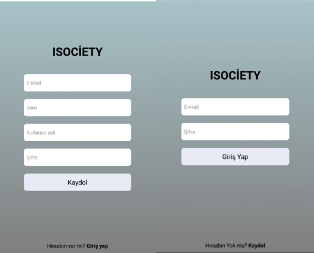
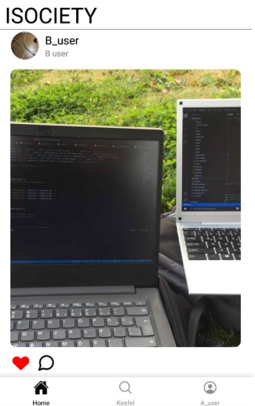
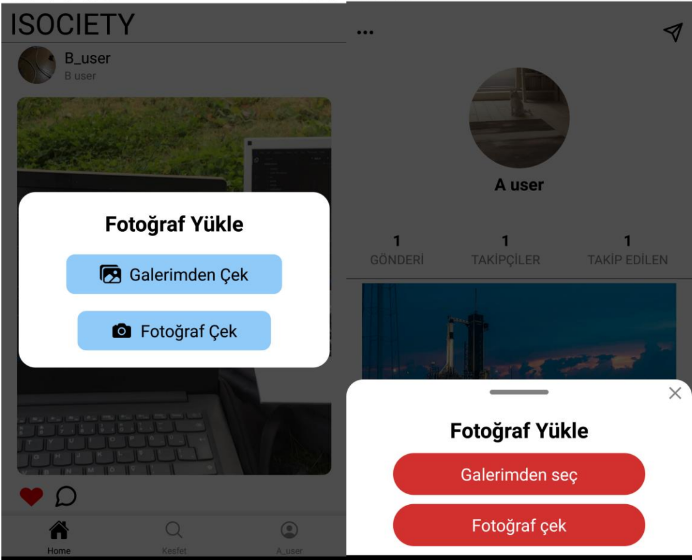
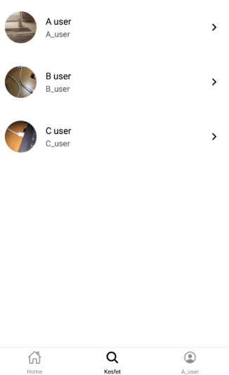
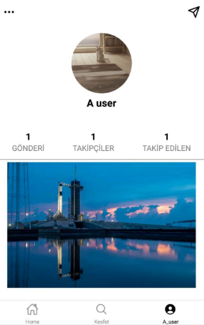

# Nedir? 
Isociety, React Native'de geliştirdiğim bir sosyal medya uygulamasıdır. Kullanıcılar fotoğraf yükleyebiliyor, diğer kullanıcıların fotoğraflarını görebiliyor. Bunun yanında birbirlerine mesaj atabiliyor ve takip edebiliyorlar.

# Kullanıcı Arayüzleri

## Kayıt / Giriş


## Ana ekran



## Keşfet


## Profil


## Kurulum

```
git clone https://github.com/musa-c/RN-SocialMediaApp.git
```

## Kullanılan Teknolojiler
- [Firebase](https://firebase.google.com/)
- [ReactNative](https://reactnative.dev/)
- [Expo](https://expo.dev/)


